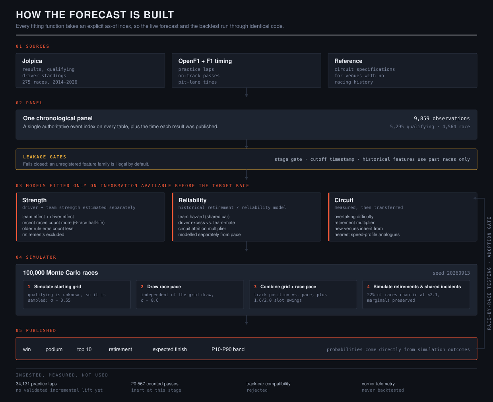

# F1 Predictor

Formula 1 forecasts and chronological model comparisons. The project reports
win, podium, top-ten and retirement probabilities, expected finishing positions,
and uncertainty intervals. It does not have an established pre-weekend ranking
advantage over the championship table.



Regenerate the diagram with `python -m scripts.make_architecture` — its counts are
read from the panel, so it cannot describe a system that no longer exists.

## Run locally

Python 3.12 is used for the checked-in environment. The historical panel is
included, so tests and model comparisons run offline.

```bash
python -m venv .venv
.venv/bin/python -m pip install -r requirements-lock.txt
.venv/bin/python -m pip install -e . --no-deps
.venv/bin/ruff check f1pred scripts tests
.venv/bin/python -m pytest --junitxml=results/tests.xml

# Chronological hierarchical pace comparison, with calibration and bootstrap gates
.venv/bin/python -m scripts.run_state_space_experiment --sims 20000

# Calibrated ranking baselines, Plackett–Luce and corrected practice pace
.venv/bin/python -m scripts.run_experiments
```

For an upcoming forecast, supply an explicit entry list and information cutoff:

```bash
.venv/bin/python -m f1pred.cli predict --season 2026 --round 14 \
    --entries configs/entries_2026_14_pre_weekend.csv \
    --cutoff 2026-09-11T01:00:00+00:00
```

That command uses the existing simulator. The state-space candidate is available
through its experiment runner and Python modules; it has not been promoted to
the forecast default. `F1PRED_HOME` can select the project data directory when
using an installed package from another working directory.

## What is being tested

The incumbent combines ridge strength estimates, a retirement model and a Monte
Carlo simulator. It retains architectural limitations: a rank-transformed race
target, hand-set noise, an observation-count uncertainty formula, confounded
team/driver coefficients and exponential recency weighting. Failed alternatives
do not resolve those criticisms.

The new candidate uses:

- Q1 and lead-lap elapsed race times in log-percentage units, with explicit
  coverage and no fastest-lap fallback.
- Team-and-lineup pace with centered teammate contrasts.
- Random-walk development and hierarchical empirical-Bayes variance estimates.
- Correlated posterior draws using uncertainty in entry differences.
- A fitted beta-binomial retirement hierarchy.
- Annual training-only variance fits, chronological winner calibration and
  paired race/block bootstrap comparisons.

The derivation, assumptions, tests and remaining limitations are in
[STATE_SPACE.md](docs/STATE_SPACE.md). Full Bayesian hyperparameter uncertainty,
clean-air pace, informative censoring and race-wide incident dynamics remain
open. The available sample does not prove an absolute ceiling on prediction.

## Madrid 2026 — issued before FP1

Round 14, forecast from an entry list dated 2026-09-07 with an information cutoff
of 2026-09-11T01:00Z, before any car ran. 100,000 simulated races, seed 20260913.

| # | Driver | Win | Podium | Top 10 | DNF risk |
|--:|---|--:|--:|--:|--:|
| 1 | Antonelli | 27.7% | 62.3% | 93.4% | 6.3% |
| 2 | Russell | 19.7% | 51.1% | 86.1% | 13.6% |
| 3 | Norris | 14.9% | 44.0% | 85.0% | 14.6% |
| 4 | Hamilton | 13.3% | 43.2% | 92.4% | 6.8% |
| 5 | Leclerc | 9.3% | 33.1% | 82.1% | 16.9% |
| 6 | Piastri | 7.9% | 30.7% | 85.5% | 13.2% |
| 7 | Verstappen | 5.9% | 24.5% | 78.6% | 19.6% |

All 22 entries, with expected finishing position and P10–P90 bands:
[`results/forecast_2026_14_pre_weekend/predictions.csv`](results/forecast_2026_14_pre_weekend/predictions.csv).
Against a bookmaker board with its 22.7% overround removed the forecast agrees at
a rank correlation of 0.928 and names the same favourite, so it is not claiming to
know something the market does not.

## Results and evidence

The current hierarchy comparison is saved in
[results/state_space_experiment](results/state_space_experiment/), including
predictions, per-race metrics, variance fits, timing coverage, per-outcome
calibration, paired intervals and every adoption gate.

Earlier calibrated ranking and practice experiments are in
[results/experiments](results/experiments/). Practice pace and Plackett–Luce did
not clear acceptance. They remain experimental. The old variance-budget test
trained on 2024–2025 and evaluated on 2022–2023; its verdict has been invalidated
because the chronology was reversed.

The historical runs called `strict` reconstructed entries before the weekend,
but assumed historical publication availability from race dates. This is not
verified timestamp evidence. Current code labels that scope
`reconstructed_snapshot`. Runs using the actual starter field are labelled
`retrospective_conditional_field`. Neither label should be presented as proven
live performance.

Changes must pass [BUILD_SPEC](docs/BUILD_SPEC.md): full tests, legal information
snapshots, primary-metric improvement without degraded calibration, and favourable
paired-bootstrap evidence on the tuning window. 2026 has already been inspected;
new confirmation needs unseen races.

## Project layout

| Path | Purpose |
|---|---|
| `f1pred/sources/` | Cached source adapters and ingestion |
| `f1pred/features/` | Existing strength, circuit, practice and reliability features |
| `f1pred/models/` | State-space hierarchy, retirement hierarchy and ranking calibration |
| `f1pred/sim/` | Existing Monte Carlo simulator |
| `f1pred/evaluation/` | Metrics, chronological comparisons and uncertainty checks |
| `scripts/` | Reproducible ingestion, experiments and reports |
| `tests/` | Offline correctness and statistical tests |
| `data/` | Historical panel and reference inputs |
| `results/` | Executed results and provenance |
| `f1pred/legacy/`, `archive/` | Earlier code and artifacts; not accepted forecast features |

The [audit](docs/AUDIT.md), [code review](docs/REVIEW_2026-09-11.md),
[experiment findings](docs/FINDINGS.md) and
[source notes](docs/sources_and_methodology.md) retain the evidence and unresolved
issues. The project is prepared for Git; no commit is created by these commands.
